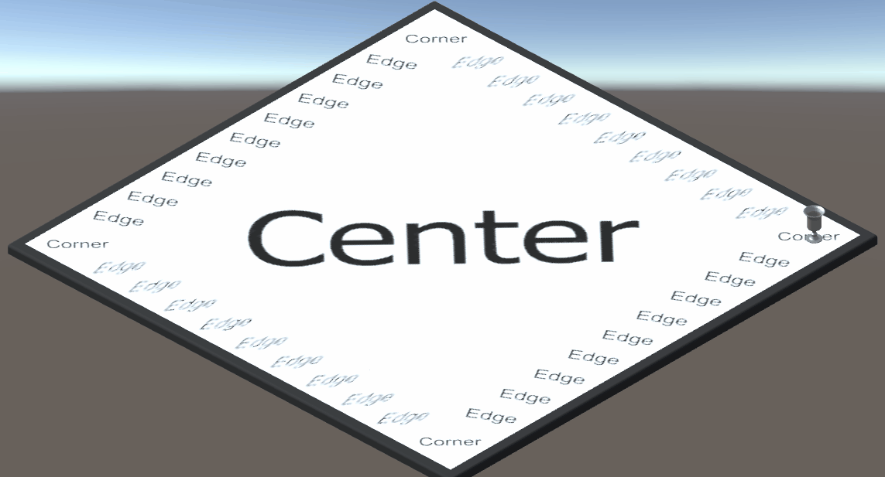

# Unity Prototype:

The aim of this prototype was to produce a visual representation of what our 3d game might look like. This was to be potentially send to the client if we proceeded further with the 3d implementation.

The prototype consists of movement around the board. The player will move up to 6 spaces around the board.

The prototype gives a visualisation of how the 3d version of the game may look. It uses 3d models and a board compromised of multible objects each representing a different square.

When the application is run, the space bar is used to move. There are also temporary images to represent different parts of the board.

The movement uses a wrap around. Once at the final index, it will loop around to the starting indeces.

## Preview:

Note: the prototype uses Unity 2018.4.9f1 (A stable long term supported build of unity)
